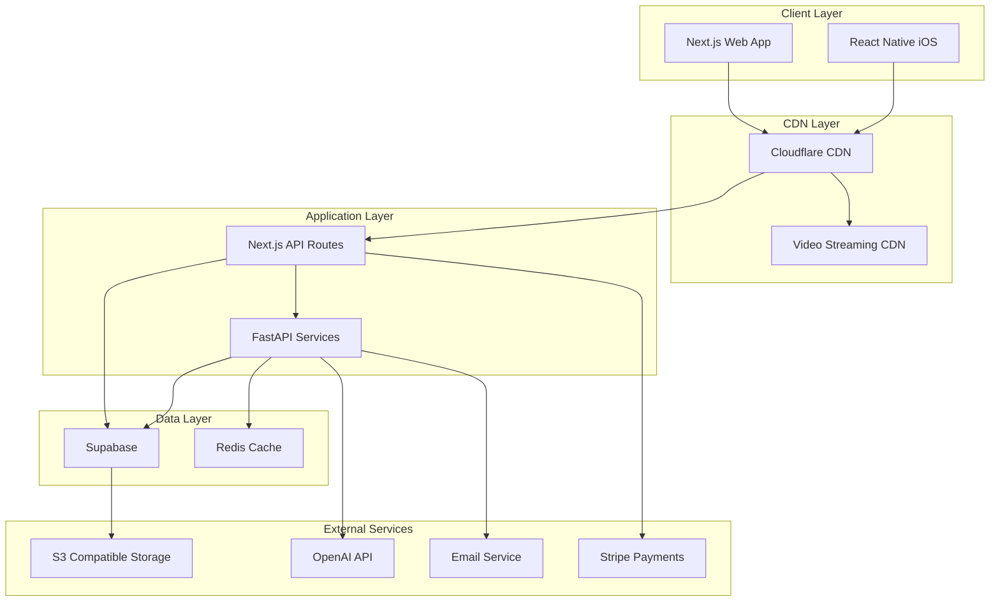

# Technical Architecture - UsefulWriter LMS

## Overview
Modern, scalable architecture using Next.js 14+, FastAPI, Supabase, and cloud services optimized for a global e-learning platform.

## Technology Stack

### Frontend
- **Framework**: Next.js 14+ with App Router
- **Language**: TypeScript 5.0+
- **Styling**: Tailwind CSS 4.0
- **Components**: shadcn/ui (Radix UI based)
- **State Management**: Zustand
- **Data Fetching**: TanStack Query v5
- **Forms**: React Hook Form + Zod
- **Video Player**: Video.js or Vidstack
- **Code Editor**: Monaco Editor (VS Code)
- **Mobile App**: React Native + Expo

### Backend Services
- **Database**: PostgreSQL via Supabase
- **Authentication**: Supabase Auth
- **File Storage**: Supabase Storage
- **Real-time**: Supabase Realtime
- **API Layer**: FastAPI (Python 3.11+)
- **Task Queue**: Celery + Redis
- **Search**: PostgreSQL Full Text Search

### Infrastructure
- **Hosting**: Vercel (Next.js) + Railway/Fly.io (FastAPI)
- **CDN**: Cloudflare
- **Video Delivery**: Cloudflare Stream or Mux
- **Email**: Resend or SendGrid
- **Payments**: Stripe
- **Monitoring**: Sentry + Vercel Analytics
- **AI/ML**: OpenAI API

## System Architecture



## Component Architecture

### Frontend Architecture (Next.js)

```
src/
├── app/                      # Next.js 14 App Router
│   ├── (auth)/              # Auth routes group
│   │   ├── login/
│   │   ├── register/
│   │   └── forgot-password/
│   ├── (dashboard)/         # Protected routes
│   │   ├── dashboard/
│   │   ├── courses/
│   │   │   ├── [slug]/
│   │   │   │   ├── page.tsx
│   │   │   │   └── lessons/
│   │   │   │       └── [lessonId]/
│   │   ├── profile/
│   │   └── settings/
│   ├── (marketing)/         # Public routes
│   │   ├── page.tsx         # Landing
│   │   ├── pricing/
│   │   └── about/
│   ├── api/                 # API routes
│   │   ├── webhooks/
│   │   │   └── stripe/
│   │   └── trpc/
│   ├── layout.tsx
│   └── providers.tsx
├── components/
│   ├── ui/                  # shadcn/ui components
│   ├── course/
│   │   ├── CourseCard.tsx
│   │   ├── CoursePlayer.tsx
│   │   └── CourseProgress.tsx
│   ├── quiz/
│   │   ├── QuizEngine.tsx
│   │   └── QuestionTypes/
│   └── layouts/
├── hooks/
│   ├── useAuth.ts
│   ├── useCourse.ts
│   └── useSubscription.ts
├── lib/
│   ├── supabase/
│   │   ├── client.ts
│   │   ├── server.ts
│   │   └── middleware.ts
│   ├── stripe/
│   └── utils/
├── stores/
│   ├── authStore.ts
│   └── courseStore.ts
└── types/
    └── database.types.ts    # Generated from Supabase
```

### Backend Architecture (FastAPI)

```
app/
├── api/
│   ├── v1/
│   │   ├── endpoints/
│   │   │   ├── courses.py
│   │   │   ├── assessments.py
│   │   │   ├── code_execution.py
│   │   │   └── ai_assistant.py
│   │   └── router.py
├── core/
│   ├── config.py
│   ├── security.py
│   └── dependencies.py
├── services/
│   ├── video_processing.py
│   ├── code_runner.py
│   ├── email_service.py
│   ├── ai_service.py
│   └── analytics.py
├── models/
│   └── schemas.py
├── tasks/
│   ├── celery_app.py
│   └── background_tasks.py
└── main.py
```

## Data Flow Patterns

### 1. Authentication Flow
```typescript
// Client-side auth with Supabase
const signIn = async (email: string, password: string) => {
  const { data, error } = await supabase.auth.signInWithPassword({
    email,
    password,
  });
  
  if (data.user) {
    // Set auth cookie for SSR
    await fetch('/api/auth/session', {
      method: 'POST',
      body: JSON.stringify({ access_token: data.session.access_token }),
    });
  }
};
```

### 2. Course Content Delivery
```typescript
// Server Component with streaming
async function CoursePage({ params }: { params: { slug: string } }) {
  const supabase = createServerClient();
  
  // Parallel data fetching
  const [course, sections, enrollment] = await Promise.all([
    supabase
      .from('courses')
      .select('*')
      .eq('slug', params.slug)
      .single(),
    supabase
      .from('course_sections')
      .select('*, lessons:course_lessons(*)')
      .eq('course_slug', params.slug)
      .order('sort_order'),
    supabase
      .from('enrollments')
      .select('*')
      .eq('course_slug', params.slug)
      .single(),
  ]);
  
  return <CourseContent {...} />;
}
```

### 3. Real-time Progress Updates
```typescript
// Real-time progress subscription
useEffect(() => {
  const channel = supabase
    .channel('progress-updates')
    .on(
      'postgres_changes',
      {
        event: 'UPDATE',
        schema: 'public',
        table: 'lesson_progress',
        filter: `user_id=eq.${userId}`,
      },
      (payload) => {
        updateProgressUI(payload.new);
      }
    )
    .subscribe();
    
  return () => {
    supabase.removeChannel(channel);
  };
}, [userId]);
```

### 4. Code Execution Service
```python
# FastAPI endpoint for code execution
@router.post("/execute")
async def execute_code(
    request: CodeExecutionRequest,
    background_tasks: BackgroundTasks,
    user=Depends(get_current_user)
):
    # Validate user has access to challenge
    if not await has_challenge_access(user.id, request.challenge_id):
        raise HTTPException(403, "Access denied")
    
    # Execute in sandboxed environment
    result = await code_runner.execute(
        language=request.language,
        code=request.code,
        test_cases=request.test_cases,
        timeout=5000,  # 5 seconds
        memory_limit=256  # MB
    )
    
    # Store submission asynchronously
    background_tasks.add_task(
        store_submission,
        user_id=user.id,
        challenge_id=request.challenge_id,
        result=result
    )
    
    return result
```

## Database Design Patterns

### Row Level Security (RLS)
```sql
-- Enable RLS on all tables
ALTER TABLE courses ENABLE ROW LEVEL SECURITY;

-- Public can view published courses
CREATE POLICY "Public courses" ON courses
  FOR SELECT
  USING (status = 'published');

-- Users can only see their enrollments
CREATE POLICY "Own enrollments" ON enrollments
  FOR ALL
  USING (auth.uid() = user_id);

-- Instructors can manage their courses
CREATE POLICY "Instructor courses" ON courses
  FOR ALL
  USING (
    auth.uid() = instructor_id
    OR 
    auth.jwt() ->> 'role' = 'admin'
  );
```

### Optimized Queries
```sql
-- Course with progress for user
CREATE OR REPLACE VIEW course_with_progress AS
SELECT 
  c.*,
  e.progress_percentage,
  e.last_accessed_at,
  COUNT(DISTINCT lp.lesson_id) as completed_lessons
FROM courses c
LEFT JOIN enrollments e ON e.course_id = c.id
LEFT JOIN lesson_progress lp ON lp.enrollment_id = e.id
WHERE lp.status = 'completed'
GROUP BY c.id, e.id;

-- Index for performance
CREATE INDEX idx_lesson_progress_lookup 
ON lesson_progress(user_id, lesson_id, status);
```

## API Design

### RESTful Endpoints (Next.js API Routes)
```typescript
// app/api/courses/[slug]/enroll/route.ts
export async function POST(
  request: Request,
  { params }: { params: { slug: string } }
) {
  const session = await getServerSession();
  if (!session) {
    return NextResponse.json({ error: 'Unauthorized' }, { status: 401 });
  }
  
  const { access_type, payment_intent } = await request.json();
  
  // Process enrollment
  const enrollment = await createEnrollment({
    user_id: session.user.id,
    course_slug: params.slug,
    access_type,
    payment_intent,
  });
  
  return NextResponse.json(enrollment);
}
```

### FastAPI Services
```python
# Video processing service
@router.post("/videos/process")
async def process_video(
    file: UploadFile,
    course_id: UUID,
    lesson_id: UUID,
    background_tasks: BackgroundTasks
):
    # Upload to temporary storage
    temp_url = await upload_to_temp(file)
    
    # Queue processing job
    job_id = str(uuid4())
    background_tasks.add_task(
        process_video_task,
        job_id=job_id,
        temp_url=temp_url,
        course_id=course_id,
        lesson_id=lesson_id
    )
    
    return {"job_id": job_id, "status": "processing"}

async def process_video_task(job_id, temp_url, course_id, lesson_id):
    # Generate multiple qualities
    qualities = await transcode_video(temp_url, ['1080p', '720p', '480p'])
    
    # Upload to CDN
    cdn_urls = await upload_to_cdn(qualities)
    
    # Update database
    await update_lesson_video(lesson_id, cdn_urls)
    
    # Send notification
    await notify_video_ready(course_id, lesson_id)
```

## Performance Optimization

### Frontend Optimization
```typescript
// 1. Image optimization with Next.js
import Image from 'next/image';

<Image
  src={course.thumbnail}
  alt={course.title}
  width={400}
  height={225}
  loading="lazy"
  placeholder="blur"
  blurDataURL={course.blurHash}
/>

// 2. Code splitting with dynamic imports
const CodeEditor = dynamic(
  () => import('@/components/CodeEditor'),
  { 
    loading: () => <Skeleton />,
    ssr: false 
  }
);

// 3. Prefetching with TanStack Query
const prefetchCourse = async (slug: string) => {
  await queryClient.prefetchQuery({
    queryKey: ['course', slug],
    queryFn: () => fetchCourse(slug),
    staleTime: 10 * 60 * 1000, // 10 minutes
  });
};

// 4. Optimistic updates
const mutation = useMutation({
  mutationFn: updateProgress,
  onMutate: async (newProgress) => {
    await queryClient.cancelQueries(['progress']);
    const previous = queryClient.getQueryData(['progress']);
    queryClient.setQueryData(['progress'], newProgress);
    return { previous };
  },
  onError: (err, newProgress, context) => {
    queryClient.setQueryData(['progress'], context.previous);
  },
});
```

### Backend Optimization
```python
# 1. Redis caching
@cached(ttl=3600)  # 1 hour
async def get_course_details(course_id: UUID):
    return await supabase.from_('courses').select('*').eq('id', course_id).single()

# 2. Database connection pooling
database_url = config.DATABASE_URL.replace('postgresql://', 'postgresql+asyncpg://')
engine = create_async_engine(
    database_url,
    pool_size=20,
    max_overflow=40,
    pool_pre_ping=True,
)

# 3. Batch operations
async def bulk_update_progress(updates: List[ProgressUpdate]):
    async with supabase.pool.acquire() as conn:
        await conn.executemany(
            """
            UPDATE lesson_progress 
            SET status = $2, completed_at = $3
            WHERE id = $1
            """,
            [(u.id, u.status, u.completed_at) for u in updates]
        )
```

## Security Implementation

### Authentication & Authorization
```typescript
// Middleware for protected routes
export async function middleware(request: NextRequest) {
  const session = await getServerSession(request);
  
  if (!session && request.nextUrl.pathname.startsWith('/dashboard')) {
    return NextResponse.redirect(new URL('/login', request.url));
  }
  
  // Check subscription for premium content
  if (request.nextUrl.pathname.startsWith('/courses/premium')) {
    const hasSubscription = await checkSubscription(session.user.id);
    if (!hasSubscription) {
      return NextResponse.redirect(new URL('/pricing', request.url));
    }
  }
  
  return NextResponse.next();
}
```

### Input Validation
```typescript
// Zod schemas for validation
const CourseSchema = z.object({
  title: z.string().min(3).max(100),
  description: z.string().min(10).max(5000),
  price: z.number().min(0).max(999999),
  category: z.enum(['programming', 'business', 'design']),
});

// API route with validation
export async function POST(request: Request) {
  const body = await request.json();
  
  try {
    const validated = CourseSchema.parse(body);
    // Process validated data
  } catch (error) {
    if (error instanceof z.ZodError) {
      return NextResponse.json(
        { errors: error.errors },
        { status: 400 }
      );
    }
  }
}
```

### Content Security
```python
# DRM for video content
@router.get("/videos/{video_id}/stream")
async def stream_video(
    video_id: UUID,
    range: Optional[str] = Header(None),
    user=Depends(get_current_user)
):
    # Verify access
    if not await has_video_access(user.id, video_id):
        raise HTTPException(403, "Access denied")
    
    # Generate signed URL with expiration
    signed_url = generate_signed_url(
        video_id,
        user_id=user.id,
        expires_in=3600  # 1 hour
    )
    
    # Return streaming response
    return StreamingResponse(
        stream_video_content(signed_url, range),
        media_type="video/mp4",
        headers=get_range_headers(range)
    )
```

## Deployment Architecture

### Production Environment
```yaml
# docker-compose.production.yml
version: '3.8'

services:
  nextjs:
    image: your-registry/nextjs-app:latest
    environment:
      - NODE_ENV=production
      - NEXT_PUBLIC_SUPABASE_URL=${SUPABASE_URL}
    ports:
      - "3000:3000"
    deploy:
      replicas: 3
      
  fastapi:
    image: your-registry/fastapi-app:latest
    environment:
      - ENVIRONMENT=production
      - DATABASE_URL=${DATABASE_URL}
    ports:
      - "8000:8000"
    deploy:
      replicas: 2
      
  redis:
    image: redis:alpine
    volumes:
      - redis-data:/data
      
  celery-worker:
    image: your-registry/fastapi-app:latest
    command: celery -A app.tasks worker --loglevel=info
    deploy:
      replicas: 2
```

### CI/CD Pipeline
```yaml
# .github/workflows/deploy.yml
name: Deploy to Production

on:
  push:
    branches: [main]

jobs:
  test:
    runs-on: ubuntu-latest
    steps:
      - uses: actions/checkout@v3
      - name: Run tests
        run: |
          npm test
          pytest
          
  deploy-nextjs:
    needs: test
    runs-on: ubuntu-latest
    steps:
      - name: Deploy to Vercel
        uses: vercel/action@v20
        with:
          vercel-token: ${{ secrets.VERCEL_TOKEN }}
          vercel-org-id: ${{ secrets.VERCEL_ORG_ID }}
          vercel-project-id: ${{ secrets.VERCEL_PROJECT_ID }}
          
  deploy-fastapi:
    needs: test
    runs-on: ubuntu-latest
    steps:
      - name: Deploy to Railway
        uses: railway/deploy-action@v1
        with:
          railway-token: ${{ secrets.RAILWAY_TOKEN }}
```

## Monitoring & Observability

### Application Monitoring
```typescript
// Sentry integration
Sentry.init({
  dsn: process.env.SENTRY_DSN,
  environment: process.env.NODE_ENV,
  integrations: [
    new Sentry.BrowserTracing(),
    new Sentry.Replay(),
  ],
  tracesSampleRate: 0.1,
  replaysSessionSampleRate: 0.1,
});

// Custom error boundary
export function ErrorBoundary({ children }: { children: React.ReactNode }) {
  return (
    <Sentry.ErrorBoundary
      fallback={<ErrorFallback />}
      showDialog
    >
      {children}
    </Sentry.ErrorBoundary>
  );
}
```

### Analytics Tracking
```typescript
// Vercel Analytics + Custom Events
import { track } from '@vercel/analytics';

// Track course enrollment
track('course_enrolled', {
  course_id: course.id,
  course_title: course.title,
  price: course.price,
  access_type: 'purchase',
});

// Track learning progress
track('lesson_completed', {
  course_id: course.id,
  lesson_id: lesson.id,
  duration_minutes: timeSpent,
  completion_percentage: progress,
});
```

## Scalability Considerations

### Horizontal Scaling
- **Next.js**: Vercel automatic scaling
- **FastAPI**: Container orchestration with Kubernetes
- **Database**: Supabase connection pooling + read replicas
- **Redis**: Redis Cluster for caching
- **Video**: CDN with edge caching

### Performance Targets
- Page Load: < 3s on 3G
- Video Start: < 2s buffering
- API Response: < 200ms p95
- Database Queries: < 50ms p95
- Concurrent Users: 10,000+
- Video Streaming: 1,000+ simultaneous

### Cost Optimization
- Use Cloudflare R2 for object storage (no egress fees)
- Implement aggressive caching strategies
- Use serverless functions for sporadic workloads
- Optimize video encoding (H.265 for supported devices)
- Database query optimization and indexing