# User Flows - UsefulWriter LMS

## Overview
This document outlines the complete user journeys through the UsefulWriter LMS platform, detailing each interaction point, decision branch, and system response.

## 1. New User Registration & Onboarding

### 1.1 Registration Flow
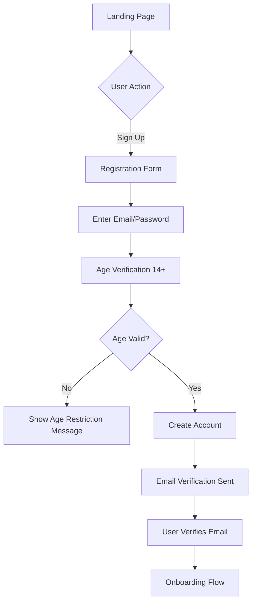

**Steps:**
1. User visits landing page
2. Clicks "Sign Up" or "Start Learning Free"
3. Enters email and password
4. Confirms age is 14 or older
5. System creates account with Supabase Auth
6. Verification email sent automatically
7. User clicks verification link
8. Redirected to onboarding flow

### 1.2 Onboarding Flow
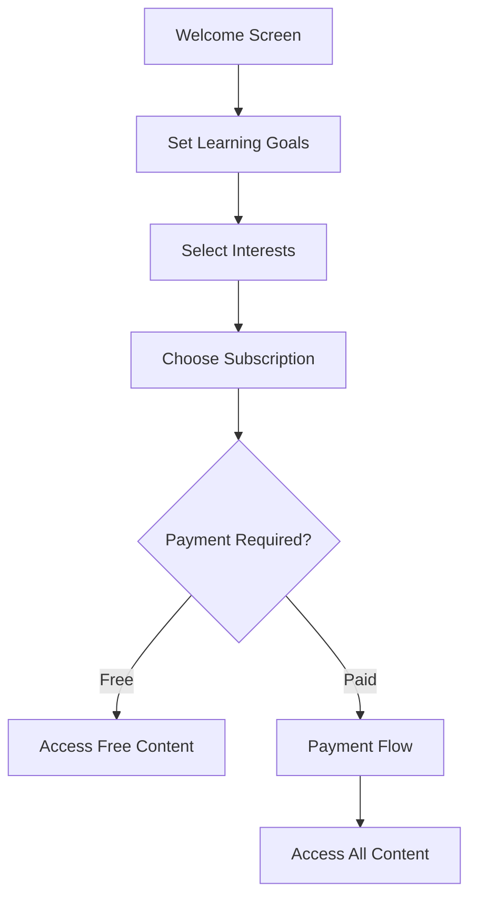

**Steps:**
1. Welcome message with platform overview
2. Set daily learning goal (15/30/60 minutes)
3. Select interest categories (programming, business, design, etc.)
4. Choose access level:
   - Free tier (limited courses)
   - Monthly subscription ($X/month)
   - Annual subscription ($Y/year)
5. If paid: redirect to payment flow
6. Dashboard with personalized course recommendations

## 2. Course Discovery & Enrollment

### 2.1 Browse Courses Flow
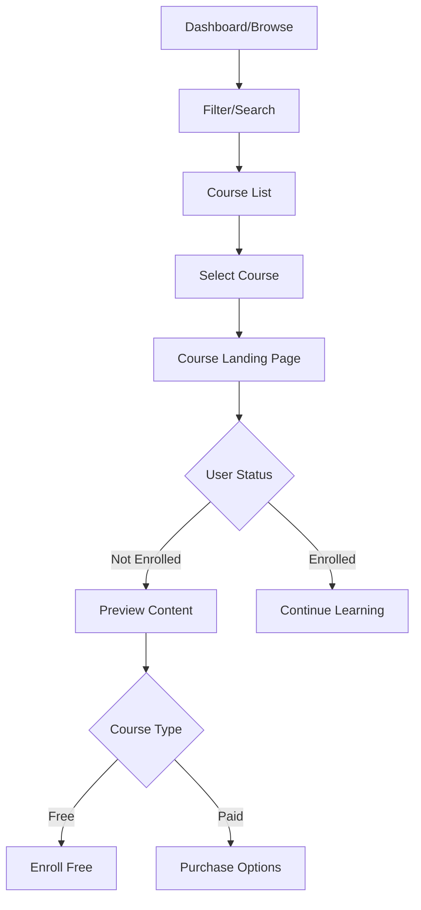

**User Actions:**
1. Navigate to course catalog
2. Apply filters:
   - Category (Programming, Business, Design)
   - Difficulty (Beginner, Intermediate, Advanced)
   - Duration (< 2 hours, 2-5 hours, 5+ hours)
   - Price (Free, Paid)
3. Search by keywords
4. View course cards with:
   - Thumbnail
   - Title and instructor
   - Duration and lesson count
   - Price or "Free"
   - Rating and enrollment count

### 2.2 Course Enrollment Flow

**Free Course:**
1. Click "Enroll for Free"
2. System creates enrollment record
3. Redirect to first lesson
4. Show success toast notification

**Paid Course (Individual Purchase):**
1. Click "Buy Course - $X"
2. Review purchase summary
3. Choose payment method
4. Enter payment details (Stripe)
5. Process payment
6. Create enrollment record
7. Send confirmation email
8. Redirect to first lesson

**Paid Course (Subscription Active):**
1. Click "Start Learning"
2. System verifies active subscription
3. Create enrollment record
4. Redirect to first lesson

## 3. Learning Experience

### 3.1 Course Navigation Flow
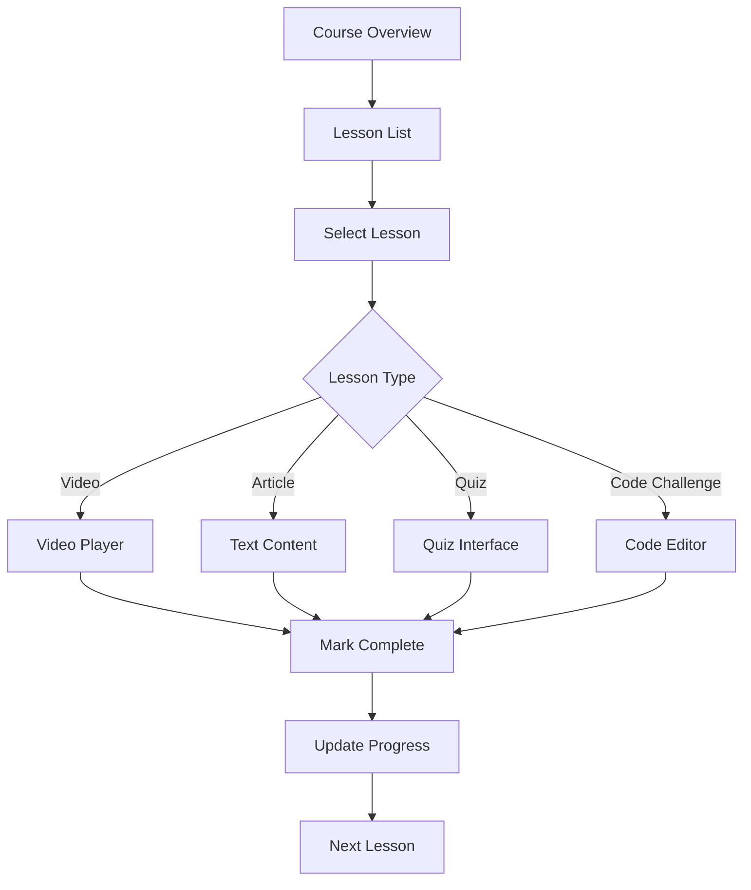

**Video Lesson Flow:**
1. Load video player with adaptive streaming
2. Resume from last position if returning
3. Show video controls:
   - Play/pause
   - Speed control (0.5x - 2x)
   - Quality selection
   - Fullscreen
   - Captions toggle
4. Track watch time
5. Auto-mark complete at 90% watched
6. Show "Next Lesson" button

**Article Lesson Flow:**
1. Display formatted text content
2. Show estimated reading time
3. Track scroll position
4. Downloadable resources section
5. Manual "Mark Complete" button
6. Auto-save reading progress

### 3.2 Quiz Flow
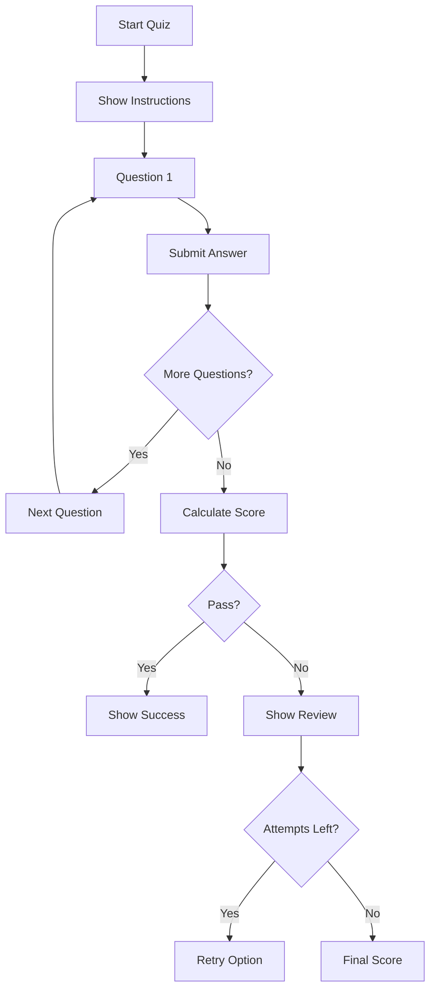

**Quiz Interaction:**
1. Display quiz instructions and passing score
2. Show question with answer options
3. User selects answer
4. If immediate feedback: show correct/incorrect
5. Navigate through all questions
6. Submit quiz for grading
7. Display results:
   - Score and percentage
   - Pass/fail status
   - Review incorrect answers
   - Explanation for each question
8. If failed and attempts remaining: offer retry
9. Update lesson progress

### 3.3 Code Challenge Flow
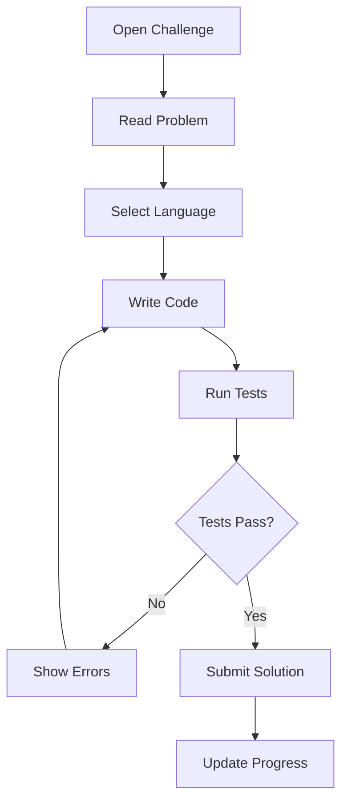

**Code Challenge Steps:**
1. Display problem statement with examples
2. Select programming language
3. Show code editor with starter template
4. Write solution
5. Run test cases:
   - Show test results in real-time
   - Display execution time and memory usage
6. Debug if tests fail
7. Submit successful solution
8. Award points/badges
9. Show optimal solution (optional)

## 4. AI Assistant Interaction

### 4.1 AI Help Flow
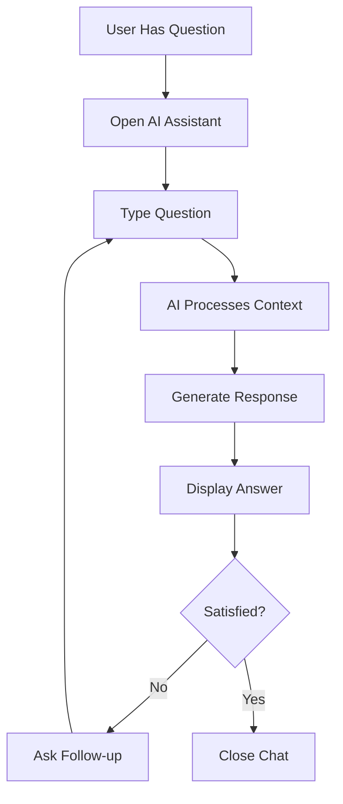

**AI Assistant Features:**
1. Floating help button on all pages
2. Context-aware (knows current course/lesson)
3. User types question
4. AI responds with:
   - Direct answer
   - Code examples if relevant
   - Links to related lessons
5. Conversation history maintained
6. Option to escalate to human support

## 5. Progress & Achievements

### 5.1 Progress Tracking Flow
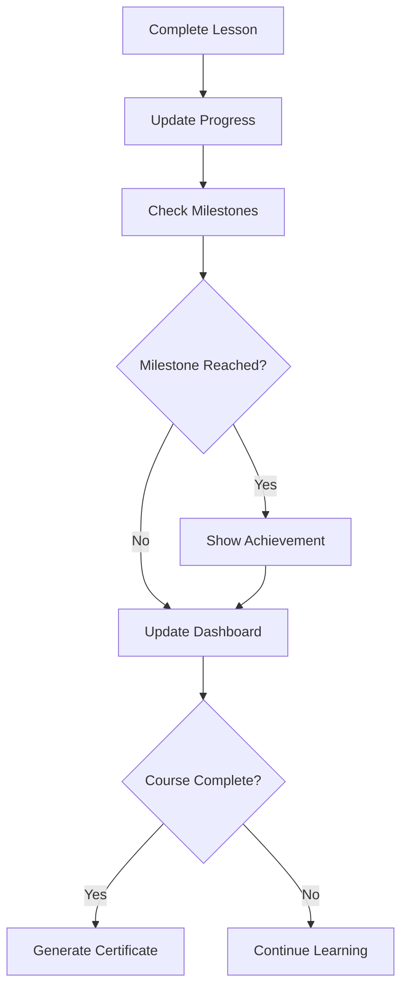

**Progress Updates:**
1. Lesson completion triggers progress update
2. Calculate course completion percentage
3. Update learning streak
4. Check for achievements:
   - First lesson complete
   - 25%, 50%, 75% milestones
   - Course completion
   - Perfect quiz score
   - Coding challenge streak
5. Display progress on dashboard
6. Send progress email (if enabled)

### 5.2 Certificate Generation Flow
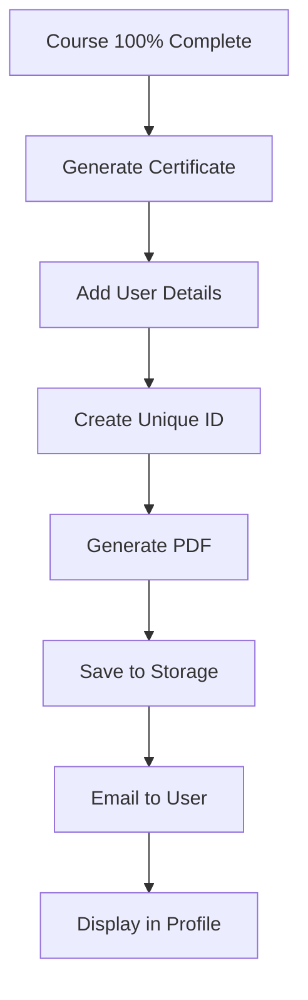

**Certificate Process:**
1. Verify all lessons completed
2. Generate certificate with:
   - User name
   - Course title
   - Completion date
   - Unique certificate ID
   - Instructor signature
3. Create PDF document
4. Store in user's profile
5. Send congratulations email with PDF
6. Add to achievements section

## 6. Payment & Subscription Management

### 6.1 Subscription Purchase Flow
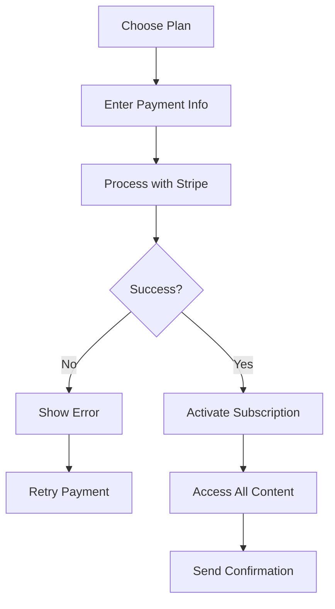

**Subscription Steps:**
1. View pricing plans
2. Select monthly or annual
3. Apply promotional code (if available)
4. Enter card details (Stripe Elements)
5. Process payment
6. Update user profile with subscription
7. Grant access to all courses
8. Send welcome email
9. Set up recurring billing

### 6.2 Cancel Subscription Flow
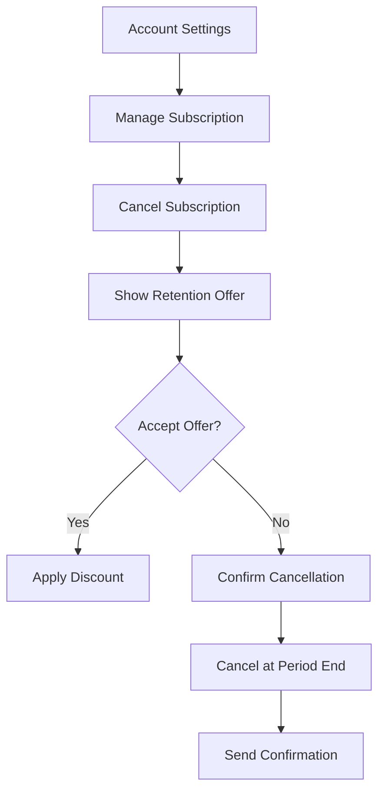

**Cancellation Process:**
1. Navigate to account settings
2. Click "Manage Subscription"
3. Select "Cancel Subscription"
4. Show retention offer (discount/free month)
5. If declined, confirm cancellation
6. Set to cancel at period end
7. Maintain access until expiration
8. Send confirmation email
9. Option to reactivate anytime

## 7. Email Course Flow

### 7.1 Email Course Signup
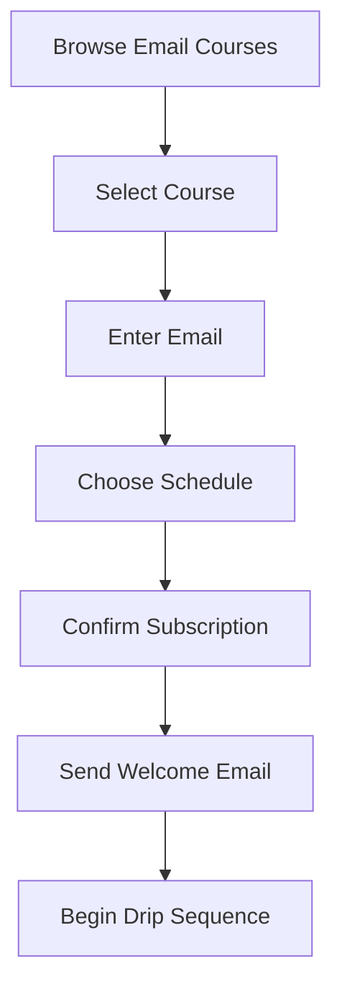

**Email Course Process:**
1. View available email courses
2. Read description and preview
3. Enter email (or use account email)
4. Select delivery schedule:
   - Daily
   - Weekdays only
   - Weekly
5. Choose preferred time
6. Confirm subscription
7. Send welcome email immediately
8. Schedule first content email

### 7.2 Email Course Delivery
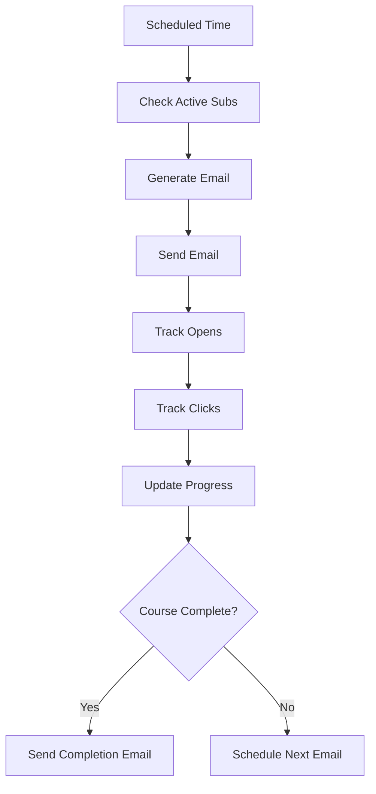

**Delivery Automation:**
1. Cron job runs at scheduled times
2. Query active subscriptions due for delivery
3. Personalize email content
4. Send via email service
5. Track engagement metrics
6. User clicks links to platform
7. Update subscription progress
8. Schedule next email or complete

## 8. Mobile App Flow (iOS)

### 8.1 Mobile Learning Flow
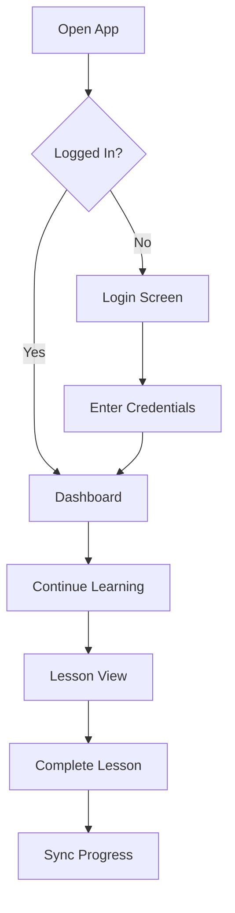

**Mobile Specific Features:**
1. Face ID/Touch ID login
2. Download resources for offline reading
3. Picture-in-picture video
4. Swipe navigation between lessons
5. Push notifications for:
   - New course content
   - Learning reminders
   - Achievement unlocks
6. Background progress sync
7. Reduced data mode for video

## 9. Admin/Instructor Flows

### 9.1 Course Creation Flow
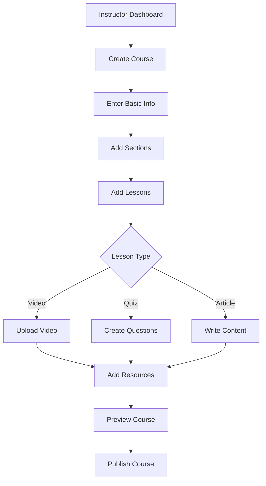

**Course Creation Steps:**
1. Access instructor dashboard
2. Click "Create New Course"
3. Enter course details:
   - Title and description
   - Category and tags
   - Difficulty level
   - Pricing
4. Create course structure:
   - Add sections
   - Add lessons to sections
   - Reorder with drag-drop
5. Upload content:
   - Videos to cloud storage
   - Write articles in editor
   - Create quizzes
   - Add code challenges
6. Preview as student
7. Publish or save as draft

### 9.2 Student Management Flow
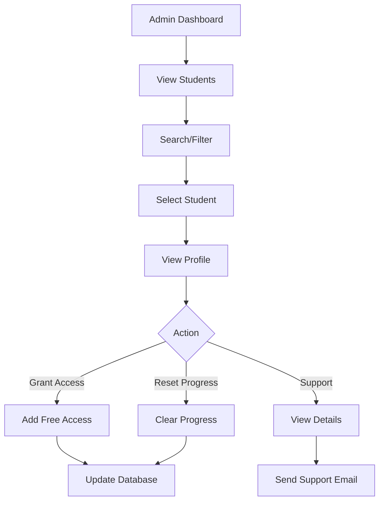

**Admin Actions:**
1. View all students
2. Search by name/email
3. Filter by subscription status
4. Grant free access to courses
5. Reset quiz attempts
6. View learning analytics
7. Send direct messages
8. Issue refunds
9. Ban/suspend accounts

## Error Handling Flows

### Payment Failure Recovery
1. Show clear error message
2. Suggest alternative payment method
3. Save cart/progress
4. Retry with same details
5. Contact support option

### Video Loading Issues
1. Detect slow connection
2. Auto-adjust quality
3. Show loading spinner
4. Offer to retry
5. Provide download option for resources

### Quiz Submission Failure
1. Auto-save answers locally
2. Show connection error
3. Retry submission automatically
4. Preserve attempt count
5. Allow manual retry

## Accessibility Flows

### Keyboard Navigation
- Tab through all interactive elements
- Enter/Space to activate
- Escape to close modals
- Arrow keys for menu navigation

### Screen Reader Support
- Proper ARIA labels
- Heading hierarchy
- Alt text for images
- Video transcripts
- Form field descriptions

### Reduced Motion
- Respect prefers-reduced-motion
- Disable auto-playing videos
- Simple transitions
- Static progress indicators